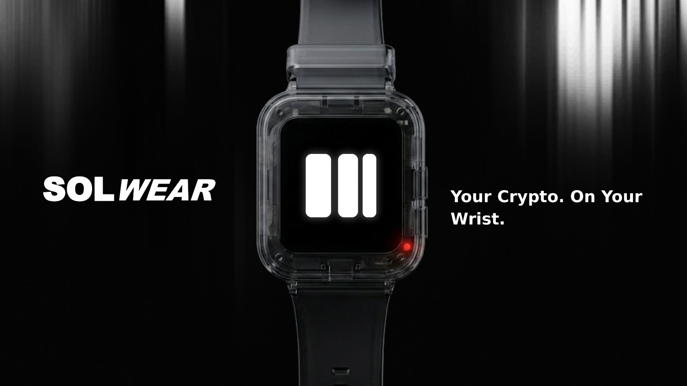

  

# SolWear

### Secure hardware wallet. Hot-wallet comfort. NFC tap-to-pay.

[Website](https://solwear.tech) | [X](https://x.com/SolWear_) | [Instagram](https://instagram.com/solwear.watch) | [TikTok](https://tiktok.com/@solwear)

SolWear is building a wearable Solana hardware wallet for everyday payments and approvals. The watch keeps custody on a dedicated device, shows confirmations on its own screen, and uses an Android phone as a fast NFC relay for tap-to-pay and transaction signing flows.

## Current Prototype

- **SolWearOS firmware** runs on an ESP32-S3 Mini prototype with a 240 x 240 ST7789 display, PN532 NFC, hardware buttons, LiPo power, and local storage.
- **Android companion app** handles wallet preview, Solana RPC, NFC pairing, signing requests, signed payload relay, and confirmation status.
- **Desktop service tool** supports serial inspection, status dashboards, settings workflows, and firmware flashing during development.
- **Public bundle** packages firmware, mobile, service tooling, website, and profile material so the full prototype can be reviewed together.

## Repositories

| Repository | Visibility | Purpose | Stack |
| --- | --- | --- | --- |
| [solwear](https://github.com/SolWear/solwear) | Public | Prototype bundle — firmware, mobile, service tool, website, and profile in one place | ESP-IDF, Kotlin, Python, Next.js |
| [solwear_site](https://github.com/SolWear/solwear_site) | Public | Product website with signup, pinboard, and supporting pages | Next.js, React, Tailwind |
| [solwear_sdk](https://github.com/SolWear/solwear_sdk) | Public | Desktop service tool for serial inspection, settings, and firmware flashing | Python, Tkinter |
| solwear_os | Private | Embedded smartwatch firmware with wallet, UI, NFC, storage, and hardware drivers | C, ESP-IDF, ESP32-S3 |
| solwear_mobile | Private | Android companion for NFC pairing, wallet preview, signing, and relay | Kotlin, Jetpack Compose |

## Why It Matters

Hardware wallets protect keys, but they are often too slow and separate for daily use. Hot wallets are convenient, but they put custody on the same device that browses, chats, and signs everything else. SolWear explores the middle: secure custody on the wrist, fast NFC interaction through the phone, and an approval loop that feels natural enough for everyday payments.

## Prototype Hardware

| Component | Part |
| --- | --- |
| MCU | ESP32-S3 Mini |
| Display | ST7789 240 x 240 IPS over SPI |
| NFC | PN532 over I2C |
| Power | TP4056 charger with 350 mAh LiPo |
| Input | Four active-low tactile buttons |
| Storage | NVS for wallet material, SPIFFS for receipts and game state |

  <a href="https://github.com/SolWear/solwear"><strong>View the public prototype bundle</strong></a>

